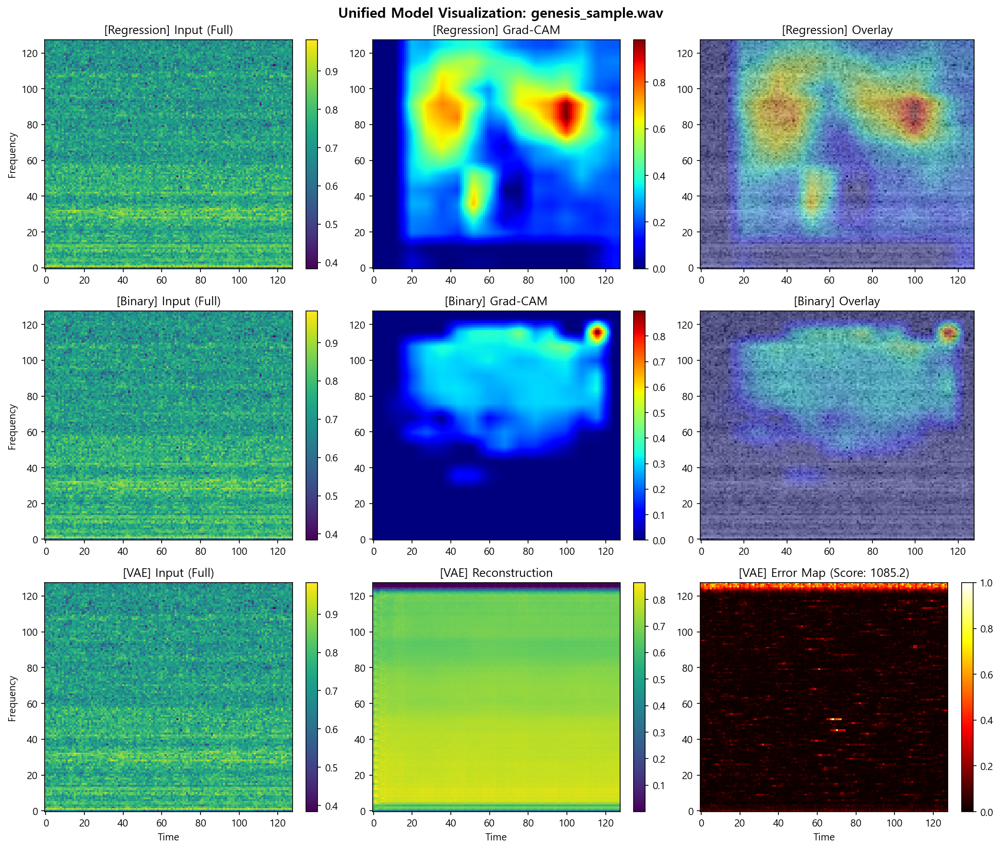

# 통합 XAI 분석 보고서

> 생성일: 2026-02-02 14:24
> 분석 파일: genesis_sample.wav

---

## 1. 분석 개요

### 목적
3개의 딥러닝 모델이 엔진 사운드를 **어떻게 분석하는지** 시각화합니다:
- **Regression Model**: 품질 점수 예측 시 주목하는 영역
- **Binary Model**: 가솔린/디젤 분류 시 주목하는 영역
- **VAE Model**: 재구성 오차로 이상 영역 탐지

### 분석 대상
| 항목 | 값 |
|------|-----|
| 파일명 | genesis_sample.wav |
| 오디오 길이 | 약 10.0초 |
| 분석 구간 | 중앙 10초 |

### 모델 상태
- **REGRESSION**: 분석 완료
- **BINARY**: 분석 완료
- **VAE**: Score 1085.2

---

## 2. 시각화 결과

---

## 3. 모델별 해석 가이드

### Regression Model (품질 점수)
- **빨간색 영역**: 품질 점수 계산에 가장 큰 영향을 주는 영역
- **해석**: 이 영역의 특성이 좋으면 높은 점수, 이상하면 낮은 점수

### Binary Model (가솔린/디젤)
- **빨간색 영역**: 연료 유형 구분에 핵심적인 주파수 대역
- **해석**: 가솔린과 디젤 엔진의 음향적 차이가 나타나는 영역

### VAE Model (이상탐지)
- **밝은 영역 (Error Map)**: 정상 패턴과 다른 이상 영역
- **해석**: 재구성이 어려운 영역 = 학습 데이터와 다른 비정상 패턴
- **Score**: 낮을수록 정상, 높을수록 이상

---

## 4. 기술적 배경

### Grad-CAM vs VAE Reconstruction Error

| 기법 | 적용 모델 | 원리 |
|------|----------|------|
| **Grad-CAM** | CNN (Regression, Binary) | 그래디언트 기반 관심 영역 시각화 |
| **Reconstruction Error** | VAE | 입력-출력 차이로 이상 탐지 |

### 스펙트로그램 4채널

| 채널 | 포착하는 특성 |
|------|--------------|
| Full | 전체 주파수 스펙트럼 |
| Percussive | 충격음, 노킹 |
| Difference | 급격한 시간 변화 |
| Variance | 불안정한 영역 |

---

## 5. 결론

이 보고서는 세 가지 관점에서 엔진 사운드를 분석합니다:
1. **품질 관점**: 어떤 특성이 품질 점수에 영향을 주는가
2. **분류 관점**: 연료 유형 구분의 핵심 특성은 무엇인가
3. **이상탐지 관점**: 정상 범위를 벗어나는 영역이 있는가

---

*이 보고서는 EGAI 시스템에 의해 자동 생성되었습니다.*
